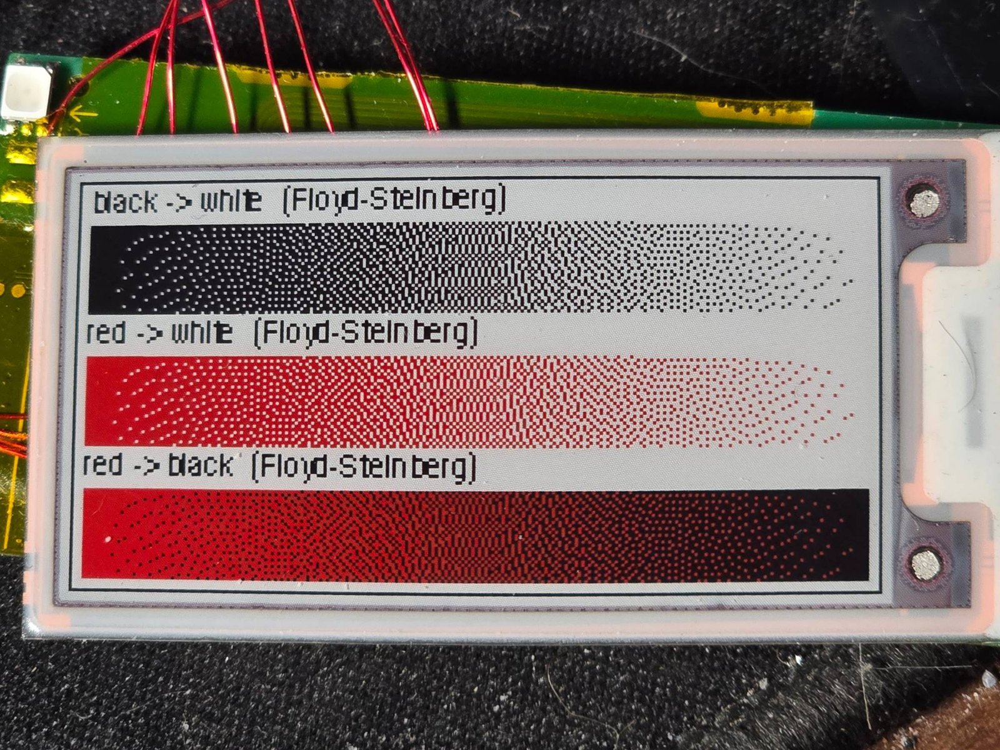
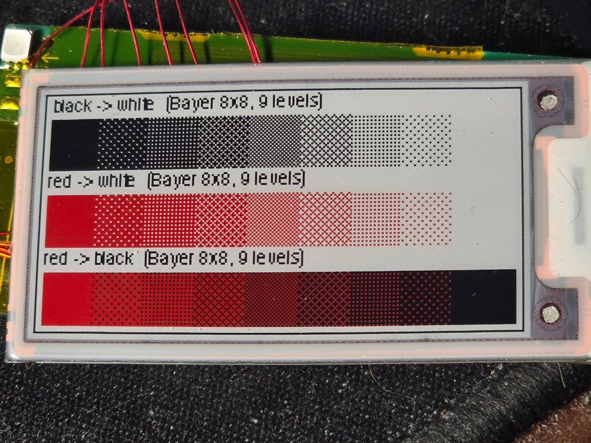
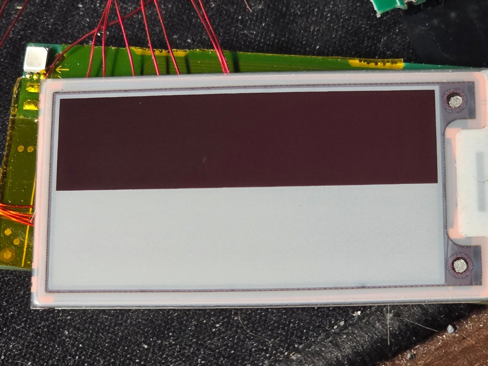
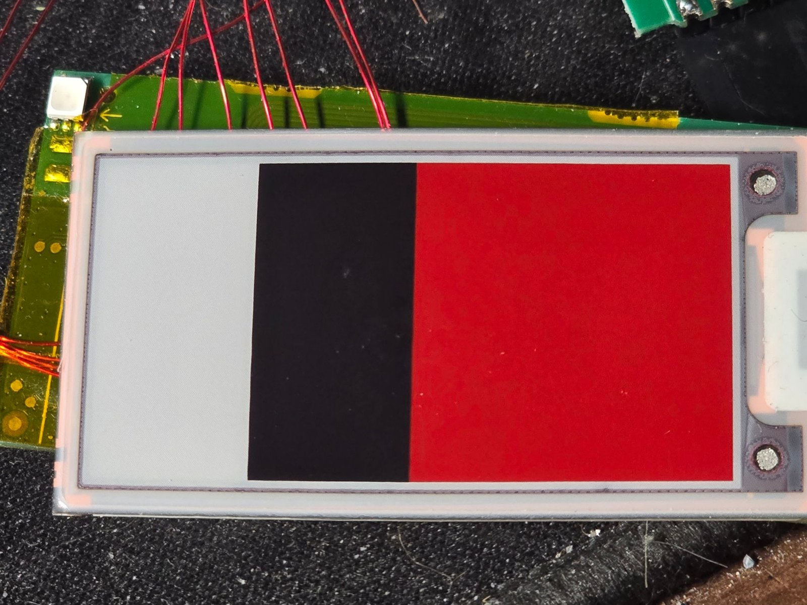

# The e-paper panel

A **Pervasive Displays 2.06" three-colour (black/white/red)** panel family part (stickers `E2206…JS…E1`; the red `J` variant is not in Pervasive's public product table, only the BW `E2206KS0E1`
and a four-colour model are, so the identification rests on size, resolution and behaviour). Public facts for the family
(<https://www.pervasivedisplays.com/products/2-06-e-ink-displays/>): **248 × 128 pixels, 0.1875 mm pitch (135 dpi), active area 46.5 × 24.0 mm, module 57.75 × 29.5 × 0.85 mm**,
internal driving with an embedded waveform, a-Si TFT, SPI. A product specification for the BW sibling with the FPC pinout and reference booster circuit is on Mouser
(`1Pxxx_00_tentative_E2206KS0E1_20230901.pdf`; fetch it in a browser).

## Interface

24-pin 0.5 mm FPC, standard e-paper layout: SPI (SCLK, SDIN, CS, D/C), RES, BUSY_N, and the booster pins (GDR, RESE, VSH/VSL/VGH/VGL, VCOM). The booster components are on the tag board.
On the tag the 7 signals below are reachable at the test points. **The panel's BS pin must be grounded for 4-wire SPI** (it is, on the tag).

| Signal | MCU pin | Test point | Notes |
|---|---|---|---|
| SDA (MOSI) | PC00 | `tp-disp-sda-pc00` | |
| SCK | PC01 | `tp-disp-sck-pc01` | SPI mode 0, MSB first; 500 kHz works from a Pico |
| CS | PC02 | `tp-disp-cs-pc02` | CS and D/C look interchangeable for commands; data frames tell them apart |
| D/C | PC03 | `tp-disp-dc-pc03` | low = command, high = data |
| RES | PC04 | `tp-disp-res-pc04` | active low reset |
| BUSY | PA08 | `tp-disp-busy-pa08` | **low = busy**; the panel holds it low until reset + power-on |
| power path | PC06 | `tp-disp-pwr-en-pc06` | **drive LOW (or float) = panel powered; HIGH hangs the power-on command** |

## Geometry and data

- The controller is driven with **250 lines × 128 rows**, but only **248 columns are visible**: lines 248 and 249 (the connector end, on the right when the connector is at the right) are not shown.
  Anything drawn at x = 249 (a 1 px border, say) is lost, so compose images at 248 wide and pad with white.
- Orientation with the connector on the right: **x = line index 0..249 left to right, y = row 0..127 bottom to top.** 16 bytes per line, 250 lines = 4000 bytes per plane.
- Two planes: **`0x10` = black/white (bit 0 = black, 1 = white)**; **`0x13` = red (bit 0 = red, 1 = no red)**. Send both before refreshing.
- Dmitry GR's notes on UC8151c panels (see [further reading](../README.md#further-reading)) say black and red data must be sent in separate passes for finer waveform work; for plain three-colour drawing one pass of each plane is enough.

## Command sequence that works

Controller behaves like **UC8151 / UC81xx (BWR)**:

| Step | Command | Data |
|---|---|---|
| reset | RES low 20 ms, high, wait 100 ms | |
| power setting | `0x01` | `03 00 2B 2B 03` |
| booster soft start | `0x06` | `17 17 17` |
| power on | `0x04` | then wait for BUSY high (~70 ms) |
| panel setting | `0x00` | **`CF`** (`0F` gave partial, faded updates) |
| resolution | `0x61` | `128, 0, 250` |
| VCOM / data interval | `0x50` | `77` |
| black/white plane | `0x10` | 4000 bytes |
| red plane | `0x13` | 4000 bytes |
| refresh | `0x12` | BUSY low for ~18-22 s |
| power off | `0x02` | wait for BUSY high |

Implementations: [`scripts/eink_draw.py`](../scripts/eink_draw.py) (host drives the MCU's pins over SWD), [`firmware/eink_receiver/receiver.c`](../firmware/eink_receiver/receiver.c) (on the MCU),
[`scripts/pico_eink.py`](../scripts/pico_eink.py) (MicroPython on a Pico, direct SPI). A full refresh takes **~22 s** (21.6-23.0 s measured) whichever of the three is used; see Timing below.

## Behaviour worth knowing

- E-paper keeps its image with no power. The factory image ("BREZZA INSTANT WMR $49.97 ...") was still on the glass of the first tag.
- The controller's frame memory survives a hardware reset and power-off: a refresh with no new data re-shows the last upload, with black/red inverted relative to what was sent.
- The border drives red on this three-colour panel (a quick way to confirm a BWR panel).
- Do not poll BUSY before reset + power-on: it reads 0 whatever the pull-up (the panel drives it low).

## Timing: where a refresh spends its time

Measured from a Pico driving the panel directly (MicroPython, 2 MHz SPI, tag MCU held in reset; `scripts/pico_uc81_probe.py` prints these):

| Phase | Time |
|---|---|
| reset pulse + wait | 120 ms |
| power + booster commands | 1 ms |
| power on (wait for BUSY high) | 50 ms |
| panel setting / resolution / VCOM commands | 1 ms |
| upload black/white plane (4000 bytes) | 20 ms |
| upload red plane (4000 bytes) | 21-22 ms |
| **refresh (BUSY low after `0x12`)** | **21.8 s** (three-colour) or **22.99 s** (see below); **19.76 s** in black/white mode |
| power off (wait for BUSY) | 20 ms |
| **total** | **22.0 s** / 23.2 s three-colour, **20.0 s** black/white mode |

**The refresh is 99 % of the total.** The interface and the controller chip are irrelevant to the speed: it is the panel's built-in waveform. So driving the panel from a Pico, from the tag's own MCU, or from a host over SWD all take
about the same ~22 s per update. Only the host-over-SWD route is slower overall (the README-era figure is ~35 s) because it bit-bangs every GPIO write itself; that route was not re-timed in the later experiments.

Observations that are not explained: the refresh time stepped from **21.81 s to 22.99 s** between two consecutive frames and then stayed there, whatever the frame (swatches, solid bands and a simple bit-pattern frame all took 22.99 s; the demo, a restore and the gradient frame took 21.81 s).
The first run, through `pico_eink.py` at 500 kHz, took 21.6 s. A temperature-compensated waveform selection would produce steps like that *(unverified)*.

## Tone and half-tone experiments

The panel has **three inks and one level of each**: no greys. The pixel pitch is 0.1875 mm (135 dpi), so every intermediate tone is **spatial dithering** (a mix of two inks that blends at a distance), and text drawn without anti-aliasing looks blocky at the pixel level.
The frames below are generated by [`scripts/make_tone_tests.py`](../scripts/make_tone_tests.py) and drawn with `scripts/pico_uc81_probe.py`; the photos are of the real panel (connector on the right).

### 1. Dithering the three inks works well

*Floyd-Steinberg error diffusion: black to white, red to white, red to black. Smooth ramps with the usual "worm" texture in the mid-tones.*

*The same three ink pairs as nine flat steps (0/8 to 8/8 coverage of the second ink) using an 8 × 8 Bayer pattern. Left swatch = 100 % of the first ink in the row's label, right swatch = 100 % of the second. All nine steps are distinguishable; red to black is the most convincing (dark-red cross-hatch).*

- The panel's "white" is a light grey, which limits the contrast of every tone.
- Mid-tones are visibly a pixel pattern up close and read as a tone from arm's length.
- For photos, `eink_draw.py --dither` and `make_frame.py --dither` do Floyd-Steinberg onto black, white and red. For flat tints, an ordered (Bayer) pattern is cleaner.
- Text: render at 14 px or larger, or scale a bitmap font; anti-aliasing followed by dithering gives noisy edges on small type, so the blocky 1-bit look is usually the better trade at this resolution.

### 2. Black/white mode (PSR `0xDF`) gives a burgundy, not a black

Setting the panel-setting byte to `0xDF` (instead of `0xCF`) selects the controller's black/white update. We sent bands of solid red, black and white as the known start state, then one such update with the "old" plane (`0x10`) = the bands' black/white plane and the "new" plane (`0x13`) = 1 in the top half of the panel and 0 in the bottom half:

- **New data 1 gave a uniform dark burgundy** (black with the red layer not fully cleared) and **new data 0 gave white**, **identical over all three old bands**. The old state is ignored: every pixel is fully driven to the target.
- **The polarity is the opposite of the three-colour mode's black/white plane** (there 0 = black; here 1 = dark). A first test with an ordinary black-on-white image came out as white text on a burgundy background for that reason.
- The refresh takes **19.8 s** instead of 21.8 s (9 % faster).
- So in this mode **per pixel you can choose burgundy or white**, but there is no pure red or black, and the whole panel is reset. It could serve as a two-tone "dark red on white" look.

### 3. Setting both bits gives red: no fourth colour

In the three-colour mode a pixel is white (bw 1, red 1), black (bw 0, red 1) or red (bw 1, red 0). We also sent (bw 0, red 0) in a fourth band:

*Bands left to right: white, black, red, and both bits set. The last two look identical.* The red plane takes priority: **(0, 0) is plain red**. The burgundy hybrid is therefore not reachable as a per-pixel colour in the normal mode.

### 4. Partial window (`0x90` + `0x91`/`0x92`): no shorter, and not understood

With the controller in black/white mode we sent a partial window for lines 30-109 (all 128 rows) and inverted data. BUSY stayed low for **19.76 s, exactly the same as a full black/white refresh**, so the window does not select a shorter waveform.
The visible result was the whole panel refreshing, then only about the left eighth (outside the window we meant) ending up bold with the rest faded. We did not characterise this further: it may be a different window orientation, or the pixels outside the window being driven from whatever
was left in the other data memory. The faded look is probably a half-driven transition from mismatched old and new data, which would not be repeatable on its own *(unverified)*.

### Consequences

| Goal | Verdict |
|---|---|
| Faster refresh | No standard-command way found: the waveform sets the time (19.8 s at best) |
| More colours in one image | No: black, white, red plus dithered mixtures of any two |
| Burgundy | Only as a whole-panel two-tone image in black/white mode |
| Smoother-looking images | Dithering (Floyd-Steinberg for photos, Bayer for flat tints) |

### Not tried (and why)

- **Custom waveforms** (set the register-LUT bit in the panel setting and write the waveform registers `0x20`-`0x24`): this is how greyscale and faster black/white updates are done on other UC8151c panels (see Dmitry GR's write-up in the README's further reading), but this panel uses an embedded waveform and we have no datasheet for it; a wrong table can leave a DC imbalance and image sticking.
- **Aborting a refresh part-way** (reset during BUSY) to freeze pigment mid-travel for greys: hard on the panel, unrepeatable, not attempted.
- **The controller's temperature sensor commands**, and the power-setting voltages (`0x01`): left at the values that work.

To reproduce: `python3 scripts/make_tone_tests.py tone-tests`, copy the `.bin` files and `scripts/pico_uc81_probe.py` to the Pico, then `probe.draw('t1_fs.bin')`, `probe.kw('kw_old_bw.bin', 'kw_new.bin')`, `probe.draw('h2.bin')` or `probe.partial_kw('frame.bin', 30, 109)`.

## Replacing the MCU's role with another controller

- **From the FPC side:** a 24-pin 0.5 mm FPC breakout (Good Display DESPI-C02, Waveshare universal raw-panel driver board) plus the booster circuit. Notes and the panel's reference circuit are in [epaper-breakout-plan.md](epaper-breakout-plan.md).
  The FPC fingers face the board on the tag; the pin order mirrors if you flip the flex.
- **From the test points:** hold the tag's MCU in reset and drive the 7 test points, see [control.md](control.md).
