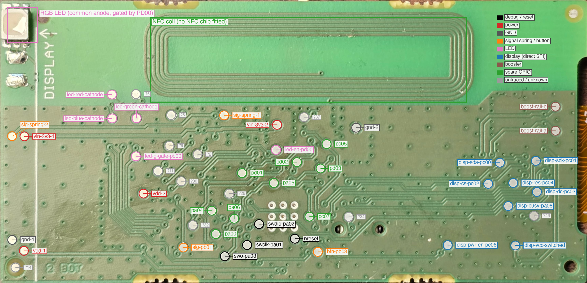
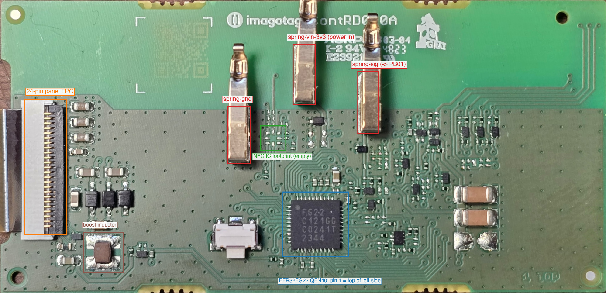

# Hardware reference: SES-imagotag HRD3-0210-A, board ContRD010A

Everything here was measured on tags bought on eBay ("HRD3-0210-A", lots of 20). Items marked *(unverified)* are inferences. The photos are in
[`../hardware/photos/`](../hardware/photos/) and annotated copies in [`images/`](images/).

## At a glance

| Part | What it is |
|---|---|
| Tag | SES-imagotag / VusionGroup 2.1" rail-powered e-paper shelf label. Label model **HRD3-0210-A**, PCB silkscreen **`imagotag ContRD010A`** (see [revisions.md](revisions.md): the label name alone does not identify the board). |
| MCU | **Silicon Labs EFR32FG22C121F512GM40**: QFN40, Cortex-M33, **512 KiB flash at `0x00000000`** (8 KiB pages), 32 KiB RAM, 2.4 GHz radio. Marking `FG22 / C121GG / C0241T / 2344`. ~19.1 MHz HFRCO after reset. Ships **debug-locked** (secure debug); the lock is cleared with the Series 2 DCI device erase, see [flashing.md](flashing.md). |
| Panel | **Pervasive Displays 2.06"** family (stickers `E2206…JS…E1`, e.g. `KE2206JSKE1 / SPP2DC1`, `SE2206JS0E1 / SPP2AC1`): **248 × 128 visible pixels, black/white/red**, 0.1875 mm pitch, active area 46.5 × 24.0 mm, built-in UC81xx-style controller with embedded waveform, **24-pin 0.5 mm FPC** (flex marking `A1360146-00`). See [display.md](display.md). |
| Power | Three spring contacts for a shelf rail: **GND, +3.3 V (centre), signal**. No battery holder. Chip VDD measures ~2.9 V when fed 3.3 V at the contact. |
| LED | One RGB LED, common anode behind a high-side switch (**PD00 = supply enable**), per-colour low-side transistors driven **active-high** by PB02 (red), PB00 (green), PB04 (blue). |
| Button | One tactile switch on **PB03**, active-low to ground (the internal pull-up works). PB03 is also a deep-sleep wake pin. |
| Signal contact | Spring contact 3 reaches **PB01** through some one-way stage (it passes high, resists being pulled low). PB01 is a deep-sleep wake pin. The rail protocol is **unknown**. |
| NFC | A printed HF coil plus an **empty** IC footprint (8 pads) and three bare tuning-capacitor pad pairs. **No NFC chip is fitted.** PA05 and PD03 go to the footprint. |
| Boost | The panel's charge pump (inductor, MOSFET + sense resistor, three Schottky diodes, capacitors) is on the board, same topology as Pervasive's reference circuit. |

## Power and the rail

- The tag is meant to clip onto a rail. For bench work feed **3.3 V into the centre spring (`spring-vin-3v3`) or a `tp-vdd` / `tp-vin-3v3` pad**, ground to `spring-gnd` or a `tp-gnd` pad.
  The tag boots from the centre contact alone.
- A diode footprint ("5C", pads 51/52 in the original numbering) sits between the centre contact and the board supply; a re-trace made it look like a clamp to GND instead of a series
  diode. *(unverified)* The "VDD is one diode drop below the contact" explanation is therefore unproven.
- **Solder the ground.** A loose ground made SWD flaky and caused brownout resets ~0.1 s after every debugger connect.
- Do not bridge the bare pads next to the big capacitors (original `pad-front-57`/`58`): that shorted the rail once. Do not feed more than 3.6 V anywhere.

## Panel power path (PC06)

PC06 (`tp-disp-pwr-en-pc06`) controls a 4-pin load switch for the panel's supply. **PC06 high cuts panel power and the controller's power-on command then never completes.
Drive it low or leave it floating.** The switched supply appears on `tp-disp-vcc-switched` *(probable, not confirmed by measurement)*.

## RGB LED

Common anode (3.3 V measured at the anode), behind a switch: with PD00 low the LED glows dimly through leakage, with PD00 high it is bright. Each colour has a transistor stage driven
active-high; **a colour pin that was driven high and then released leaves its channel on** (the gate holds charge), so drive it low for ~2 s to clear. Blue is dimmer than red/green
(needs ~3 V forward voltage). **It is painfully bright at full duty**: the firmware here dims it to 10 % by software PWM on PD00 (see [control.md](control.md)).

## What is not known

- The rail protocol on the signal contact and what the original firmware did with it.
- The exact part and orientation of the "5C" diode, the transistors marked "ZV", the inductor value.
- Pins with no known function: PA00 (its net merged into VDD in the trace, probably an artefact), PA03 (SWO), PA04-PA07, PC05, PC07, PD01-PD03 beyond being test points.
- The 2.4 GHz antenna and matching network (RF2G4_IO, pin 14) were not traced.

The chronological story, including wrong turns, is in [research-log.md](research-log.md).
