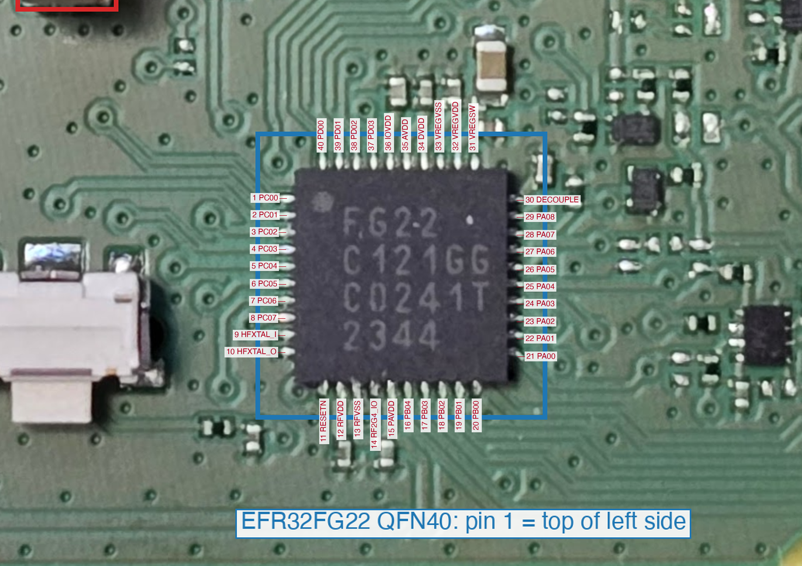

# Pinout: EFR32FG22 (QFN40) pins, test points and what they do

Pin 1 is the dot corner: in `hardware/photos/mcu-side.jpg` it is the **top pad of the left side**; numbering runs counter-clockwise (left side down, bottom row left to right,
right side up, top row right to left). Confirmed by RFVSS (pin 13) landing on ground and PAVDD (pin 15) on the supply net.

## MCU pins

| Pin | Name | Function on this tag | Test point (coil side) |
|---|---|---|---|
| 1 | PC00 | panel **SDA / MOSI** | `tp-disp-sda-pc00` |
| 2 | PC01 | panel **SCK** | `tp-disp-sck-pc01` |
| 3 | PC02 | panel **CS** | `tp-disp-cs-pc02` |
| 4 | PC03 | panel **D/C** | `tp-disp-dc-pc03` |
| 5 | PC04 | panel **RES** | `tp-disp-res-pc04` |
| 6 | PC05 | spare (wake-capable, EM4WU7) | `tp-pc05` |
| 7 | PC06 | panel power path (**drive low = on**) | `tp-disp-pwr-en-pc06` |
| 8 | PC07 | spare (wake-capable, EM4WU8) | `tp-pc07` |
| 9, 10 | HFXTAL_I / O | HFXO crystal (frequency not measured; 38.4 MHz is the usual FG22 value) | - |
| 11 | RESETn | reset (internal pull-up) | `tp-nreset` |
| 12 | RFVDD | radio supply | - |
| 13 | RFVSS | radio ground | `tp-gnd-1`, `tp-gnd-2` (ground net) |
| 14 | RF2G4_IO | 2.4 GHz antenna (not traced) | - |
| 15 | PAVDD | supply | `tp-vdd-1`, `tp-vdd-2` |
| 16 | PB04 | LED **blue** (active-high) | - |
| 17 | PB03 | **button** (active-low) | `tp-btn-pb03` |
| 18 | PB02 | LED **red** (active-high) | - |
| 19 | PB01 | **signal spring** input (wake-capable, EM4WU3) | `tp-sig-pb01` |
| 20 | PB00 | LED **green** (active-high) | `tp-led-g-gate-pb00` |
| 21 | PA00 | spare; **traced onto the VDD net, probably a tracing artefact** | `tp-pa00` |
| 22 | PA01 | **SWCLK** | `tp-swclk-pa01` |
| 23 | PA02 | **SWDIO** | `tp-swdio-pa02` |
| 24 | PA03 | SWO | `tp-swo-pa03` |
| 25 | PA04 | spare | `tp-pa04` |
| 26 | PA05 | spare; NFC IC footprint pad | `tp-pa05` |
| 27 | PA06 | spare | `tp-pa06` |
| 28 | PA07 | spare | - |
| 29 | PA08 | panel **BUSY** (low = busy) | `tp-disp-busy-pa08` |
| 30 | DECOUPLE | decoupling capacitor | - |
| 31-36 | VREGSW, VREGVDD, VREGVSS, DVDD, AVDD, IOVDD | supply pins | - |
| 37 | PD03 | spare; NFC IC footprint pad | `tp-pd03` |
| 38 | PD02 | spare | `tp-pd02` |
| 39 | PD01 | spare | `tp-pd01` |
| 40 | PD00 | **LED supply enable** (high = on) | `tp-led-en-pd00` |

## Other pads worth knowing

| Name | What |
|---|---|
| `spring-gnd`, `spring-vin-3v3`, `spring-sig` | the three spring contacts (ground, +3.3 V in, signal -> PB01) |
| `tp-vin-3v3-1`, `tp-vin-3v3-2` | test points on the centre spring's net |
| `tp-sig-spring-1`, `tp-sig-spring-2` | test points on the signal spring's net |
| `tp-led-red-cathode`, `tp-led-green-cathode`, `tp-led-blue-cathode` | the LED's cathodes (the transistor drain side) |
| `tp-disp-vcc-switched` | probably the panel's switched supply |
| `tp-boost-rail-a`, `tp-boost-rail-b` | probably panel booster rails; **may carry high voltage, do not probe casually** |
| `l-boost` | boost inductor footprint |
| `fp-nfc-ic` | empty NFC IC footprint (8 pads; PA05 and PD03 reach it) |
| `led-pad-1`..`led-pad-6` | the RGB LED package pads |

Unlabelled test points on the photo (`?N`) are untraced: `tp-back-N` in the netlist. The old auto-numbered IDs and the names used here are mapped in
[`../hardware/netlist/id-map.json`](../hardware/netlist/id-map.json); [research-log.md](research-log.md) uses the **old** IDs.

## Netlist files

- [`../hardware/netlist/contrd010a.svg`](../hardware/netlist/contrd010a.svg): the traced board (photos embedded, ~21 MB), made with [circuit-tracer](https://github.com/georgestephanis/circuit-tracer). Open it in a browser or Inkscape; the names above are the element IDs.
- [`../hardware/netlist/contrd010a-netlist.json`](../hardware/netlist/contrd010a-netlist.json): nets and components as JSON. Net names are `PINnn_NAME` for MCU nets and descriptive names (`DBG_SWCLK`, `DISP_SDA`, `VDD`, `GND`...) for known ones; the rest are tracer-numbered `NETn`.
- The tracing is **partial**: the absence of a connection in the netlist is not evidence that none exists.
- `python3 tools/make_annotated_images.py` regenerates the annotated photos from the SVG.
